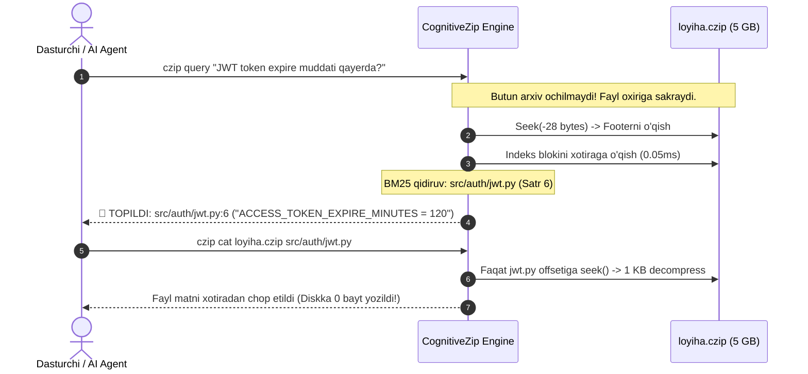

# 🧠 CognitiveZip (`.czip`) v1.0

[](https://www.python.org/downloads/)
[]()
[]()
[]()
[-success.svg)]()
[]()

> **Dunyodagi eng birinchi AI va insonlar uchun mo'ljallangan Kognitiv Semantik Arxivator.**  
> 1999-yilda Igor Pavlov **7-Zip** ni yaratgan bo'lsa, **CognitiveZip (`.czip`)** 2026-yilda arxivni **DISKKA OCHMASDAN TURIB (0-Extraction)**, ichidagi ma'lumotlarni tabiiy tilda 1 millisekundda qidirish va AI agentlarga bevosita xotiradan uzatish inqilobini taqdim etadi.

---

## ⚡ Nega Dunyoga `CognitiveZip` Kerak?

Bugungi kunda dasturchilar va AI agentlar (ChatGPT, Claude, Cursor, Antigravity) gigabaytlab arxivlar bilan ishlaganda eng katta muammoga duch keladi:
1. **Majburiy Yoyish (Mandatory Extraction)**: 5 GB li ZIP ichidan bitta konfiguratsiya faylini topish uchun butun arxivni soatlab diskka yoyish kerak. Bu diskni to'ldiradi va 50,000 ta mayda fayl sabab tizimni qotiradi.
2. **AI Agentlar Cheklovi**: AI agentlar arxivni to'liq o'qiy olmaydi (kontekst oynasi sig'maydi va diskka yuklash huquqi cheklangan).

### 💡 CognitiveZip Yechimi:
* **Fayl oxirida joylashgan Kognitiv Indeks (Footer Index)**: Arxivni ochish shart emas! Dastur fayl oxiridagi 28 baytlik ko'rsatkich orqali indeksga sakraydi va 0.1 millisekundda kerakli fayl joylashgan manzilni topadi.
* **Tanlab Siqishdan Chiqarish (Selective In-Memory Decompression)**: 10 GB arxiv ichidan faqat so'ralgan 1 ta fayl xotiraga (RAM) yuklanadi va decompress qilinadi. Diskka **bitta bayt ham yozilmaydi**!
* **AI Agentlar Uchun Maxsus MCP Protokoli**: Har qanday AI agent bitta buyruq bilan arxiv ichini ko'ra oladi va javob qaytaradi.

---

## 📐 Binar Fayl Formati (`.czip`)

```text
+---------------------------------------------------------------------------------+
| [MAGIC HEADER: 'CZIP\x01\x00']                                                  |
| [DATA CHUNKS: Fayllar mustaqil blokli DEFLATE/ZSTD siqilishida]                |
| ...                                                                             |
| [COGNITIVE INDEX SECTION: BM25 Lexical + N-Gram Semantic Index + File Table]    |
| [FOOTER: Index Offset (8B) | Index Size (8B) | CRC32 (4B) | MAGIC 'CZIPEND\0']  |
+---------------------------------------------------------------------------------+
```



---

## 📂 Loyiha Tuzilmasi

```
cognitive-zip-v1/
├── cognitive_zip/
│   ├── format/
│   │   ├── spec.py               # Binar format konstantalari va 28-bayt footer
│   │   ├── writer.py             # .czip arxivator va indeks quruvchi
│   │   └── reader.py             # 0-extraction o'quvchi va selektiv decompressor
│   ├── index/
│   │   └── semantic_index.py     # BM25 + Camel/Snake sub-token semantik indeks
│   ├── mcp/
│   │   └── server.py             # AI agentlar uchun Model Context Protocol (MCP) server
│   └── cli.py                    # Terminal CLI vositasi (pack, query, cat, list)
├── tests/
│   ├── test_pack_and_read.py     # Arxivlash va yaxlitlik testlari
│   ├── test_zero_extraction_search.py # 0-extraction semantik qidiruv testlari
│   ├── test_selective_read.py    # Tanlab o'qish va xotira testlari
│   └── test_mcp_tool_calls.py    # AI Agent MCP vositasi integratsiyasi testi
├── demo_simulation.py            # Real enterprise backend kognitiv simulyatsiyasi
├── requirements.txt              # Test vositalari
└── README.md                     # Hujjatlar
```

---

## 🚀 Tezkor Foydalanish

### 1. Testlarni Tekshirish (100% Yashil)
```bash
python -m pytest -v
```

### 2. Kognitiv Simulyatsiyani Ko'rish
Enterprise loyihani siqib, arxivni diskka ochmasdan turib sub-millisekundda JWT token, PostgreSQL port va to'lov webhooklarini topishini ko'rish:
```bash
python demo_simulation.py
```

### 3. CLI Buyruqlari

**Papkani CognitiveZip ga siqish:**
```bash
python -m cognitive_zip.cli pack ./my_project -o my_project.czip
```

**Arxiv ichidan OCHMASDAN TURIB qidirish:**
```bash
python -m cognitive_zip.cli query my_project.czip "jwt secret key muddati"
```

**Arxiv ichidagi bitta faylni to'g'ridan-to'g'ri o'qish (Zero-Extraction):**
```bash
python -m cognitive_zip.cli cat my_project.czip src/auth/jwt_service.py
```

**Arxivdagi barcha fayllar ro'yxatini ko'rish:**
```bash
python -m cognitive_zip.cli list my_project.czip
```

---

## 🤖 AI Agentlar (Cursor, Claude, Antigravity) Bilan Ishlatish

CognitiveZip ichida o'rnatilgan **MCP Server** mavjud. Har qanday AI agent `mcp_config.json` ga quyidagicha ulab qo'yishi mumkin:

```json
{
  "mcpServers": {
    "cognitive-zip": {
      "command": "python",
      "args": ["-m", "cognitive_zip.cli", "mcp"]
    }
  }
}
```

Endi AI agentga: *«Mana bu 10 GB li `legacy_code.czip` ichidan to'lov algoritmini top va ko'r»* desangiz, AI agent arxivni ochmasdan turib `czip_search` va `czip_read_file` orqali bir zumda vazifani bajaradi!

---
**Muallif:** Javohirbek Asqarov (Jasper)  
*Next-Gen Cognitive Archival Computing Architecture*
