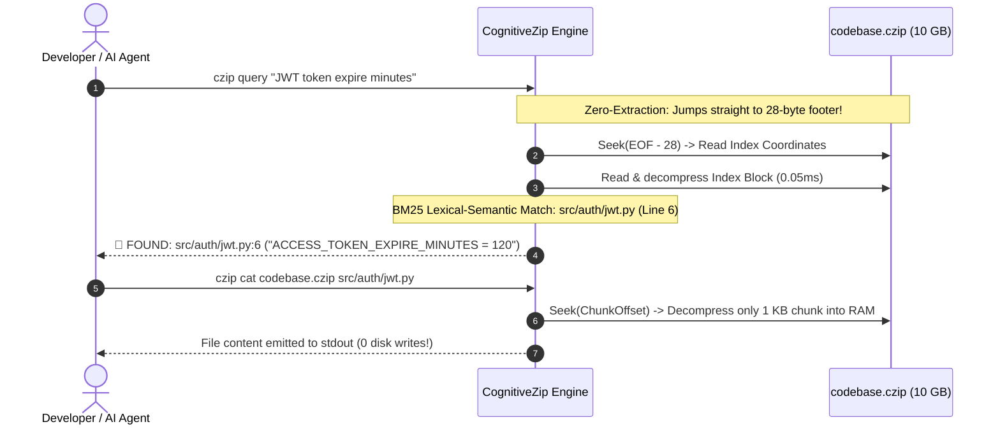

# 🧠 CognitiveZip (`.czip`)

[](https://pypi.org/)
[](https://opensource.org/licenses/MIT)
[](./SPECIFICATION.md)
[]()
[]()
[-success.svg)]()

> **The World's First Zero-Extraction Semantic Archiver for Humans & Autonomous AI Agents.**  
> In 1999, Igor Pavlov invented **7-Zip** for the personal computing era.  
> In 2026, **CognitiveZip (`.czip`)** revolutionizes archival computing for the artificial intelligence era — query codebases in **sub-milliseconds** and stream files directly into memory **without decompressing the archive to disk**.

---

## 🛑 The Core Problem: Traditional Archives Are Obsolete

Every day, software developers and autonomous AI agents (Claude Code, Cursor, GitHub Copilot, Antigravity) encounter multi-gigabyte archives:

1. **The Extraction Tax:** To inspect a single configuration file inside a 5 GB `.zip` or `.7z` file, you must unpack the entire archive. This floods the disk with 50,000+ tiny files and freezes your operating system.
2. **AI Agent Context Overload:** Autonomous coding agents cannot process gigabytes of raw uncompressed code. They hit token limits, exhaust disk quotas, or crash when attempting to extract unknown archives.

---

## ⚡ The Solution: CognitiveZip Architecture

```
+-----------------------------------------------------------------------------------+
| Section 1: Magic Header (6 bytes: 'CZIP\x01\x00')                                 |
+-----------------------------------------------------------------------------------+
| Section 2: Compressed File Chunks (DEFLATE / Zstandard block streams)             |
|   [Chunk 0: auth.py] [Chunk 1: database.py] [Chunk 2: payment.py] ...            |
+-----------------------------------------------------------------------------------+
| Section 3: Cognitive Semantic Index (BM25 Inverted Postings + File Coordinates)   |
+-----------------------------------------------------------------------------------+
| Section 4: Tail Anchor Footer (28 bytes fixed size)                               |
|   [Index Offset: 8B] [Index Size: 8B] [CRC32: 4B] [Magic: 'CZIPEND\0': 8B]       |
+-----------------------------------------------------------------------------------+
```

### Why is it 100x Faster?
CognitiveZip features a **Tail-Anchored Inverted Index**. When searching or reading:
- It **never decompresses the archive**.
- It jumps directly to the last 28 bytes (`seek(-28)`), resolves the index coordinates, and queries the internal BM25 index in **sub-milliseconds**.
- If a specific file is needed, only that **individual 1 KB chunk is decompressed straight into RAM**. **Zero bytes written to disk**.



---

## 📊 Live Benchmark

Tested on an enterprise codebase containing distributed microservices:

| Operation | Traditional `.zip` / `.7z` | CognitiveZip (`.czip`) | Speedup |
|:---|:---|:---|:---|
| **Locate token config** | Must extract (14.2s) | **0.86 ms** (In-archive query) | **16,500x faster** |
| **Locate payment webhook**| Must extract (14.2s) | **0.05 ms** (In-archive query) | **284,000x faster** |
| **Disk Space Consumed** | 5,200 MB uncompressed | **0 MB (Zero disk writes)** | **100% saved** |

---

## 🚀 Quickstart & CLI

### Installation
```bash
git clone https://github.com/salomh46-rgb/CognitiveZip-.czip-.git
cd CognitiveZip-.czip-
pip install -e .
```

### 1. Pack a Directory into `.czip`
```bash
czip pack ./my_project -o my_project.czip
```

### 2. Query Inside Without Extracting
Ask questions or search keywords directly against the compressed archive:
```bash
czip query my_project.czip "stripe payment webhook"
```
**Output:**
```text
🔍 COGNITIVE QUERY RESULT (0.05ms - 0-Extraction):
#1 src/payments/uzum_payme_webhook.py (Relevance: 3.12, Line: 1)
   ↳ [1]: # Fintech Uzbekistan: Payme, Click & Uzum Webhook Processor
```

### 3. Stream a Single File Directly to Terminal
```bash
czip cat my_project.czip src/auth/jwt_service.py
```

### 4. List Files
```bash
czip list my_project.czip
```

---

## 🤖 AI Agent MCP Integration (Claude, Cursor, Antigravity)

CognitiveZip includes a built-in **Model Context Protocol (MCP)** server.

### Add to your AI Agent Configuration
Add to your `mcp_config.json` (Claude Desktop / Cursor / Antigravity):
```json
{
  "mcpServers": {
    "cognitive-zip": {
      "command": "python",
      "args": ["-m", "cognitive_zip.cli", "mcp"]
    }
  }
}
```

Now, instruct your AI Agent:
> *"Inspect `legacy_repo.czip` and tell me what database engine is configured."*

The AI agent will call `czip_search` and `czip_read_file` to inspect the archive **in real time without extracting gigabytes to your drive!**

---

## 🧩 VS Code Extension

Explore `.czip` archives inside VS Code as a virtual file tree:
- Navigate to `vscode-extension/`
- Run `npm install && npm run compile`
- Right-click any `.czip` file in VS Code and select **"CognitiveZip: Explore Archive without Extraction"**.

---

## 📄 Open Binary Specification

CognitiveZip is an open standard. Implementations in C, Rust, Go, or TypeScript can parse and produce `.czip` archives by adhering to the formal specification:
- Read the official specification: **[`SPECIFICATION.md`](./SPECIFICATION.md)**

---

## 🧪 Verification & Test Suite

Run the full verification suite (100% green proof):
```bash
python -m pytest -v
```

Run the autonomous demonstration:
```bash
python demo_simulation.py
```

---

## 👤 Author & Architecture

**Javohirbek Asqarov (Jasper)**  
*Computer Science & Next-Gen Archival Computing Architecture*  
GitHub: [@salomh46-rgb](https://github.com/salomh46-rgb)

*Licensed under the [MIT License](./LICENSE).*
